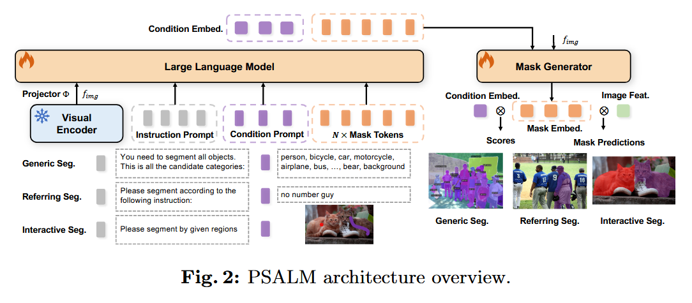
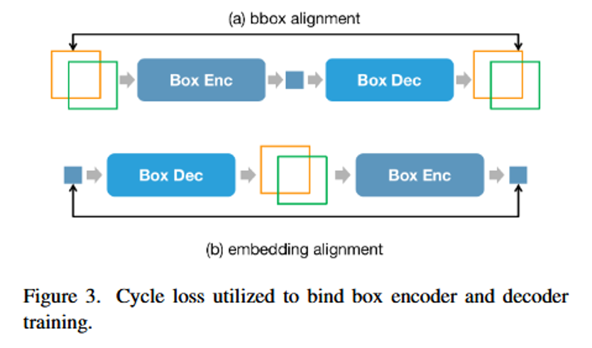
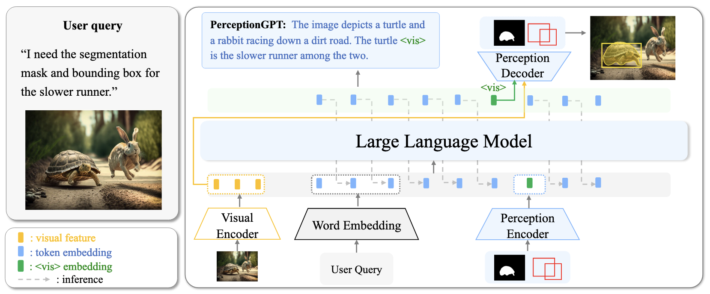
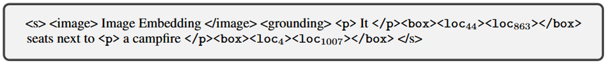
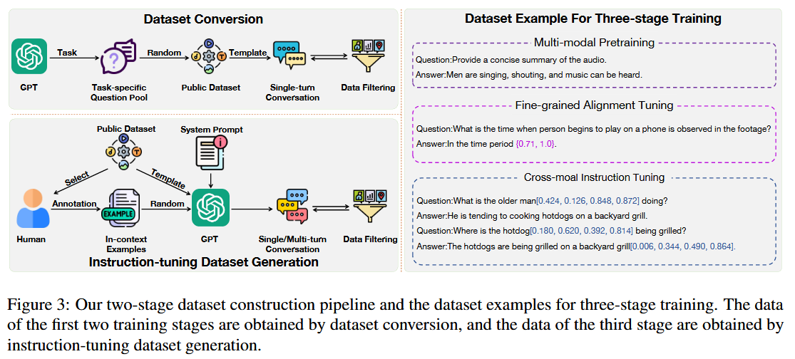

# Awesome-Multimodal-Large-Language-Models-With-Grounding
> A curated list of Multimodal Large Language Models (or Large Vision Language Model) with grounding ability. 

<!-- ## About Me: 
I'm an incoming Ph.D. student at the University of California San Diego. I recieved my M.S.E in Computer Science at Johns Hopkins University being a member of CCVL advised by [Alan Yuille](https://www.cs.jhu.edu/~ayuille/). I also work closely with [Haohan Wang](https://haohanwang.github.io/) from University of Illinois Urbana-Champaign.
Feel free to visit my [homepage](https://williamium3000.github.io/) and contact me for collaboration and discussion. -->

## Table of Contents
- [Awesome-Multimodal-Large-Language-Models-With-Grounding](#awesome-multimodal-large-language-models-with-grounding)
  - [Table of Contents](#table-of-contents)
  - [🔥 Large Vision-Language Model](#-large-vision-language-model)
    - [Grounding](#grounding)
    - [Referring](#referring)
    - [Dataset](#dataset)
    - [Paper List](#paper-list)
  - [🔥 Multi-modality](#-multi-modality)

## 🔥 Large Vision-Language Model

### Grounding
| Format | Desc | Paper | 
|------------|-------|--------|
| Decoder on latent| leverage a decoder to ground | [PerceptionGPT](https://arxiv.org/pdf/2311.06612), [NExT-Chat](https://arxiv.org/pdf/2311.04498), [PSALM](http://arxiv.org/abs/2403.14598), [PixelLM](http://arxiv.org/abs/2312.02228), [u-LLaVA](http://arxiv.org/abs/2311.05348), [GSVA](http://arxiv.org/abs/2312.10103)|
| Output numerical coordinates | direct output numerical tokens | [Shikra](https://arxiv.org/pdf/2306.15195), [VisionLLM](https://proceedings.neurips.cc/paper_files/paper/2023/file/c1f7b1ed763e9c75e4db74b49b76db5f-Paper-Conference.pdf), [Ferret](http://arxiv.org/abs/2310.07704), [Ferret2](http://arxiv.org/abs/2404.07973), [CogVLM](http://arxiv.org/abs/2311.03079)|
| Output token coordinates | output new tokens added to refer positions | [Kosmos-2](https://arxiv.org/pdf/2306.14824) |
| Pixel space | output in discrete pixel space encoded by VQGAN | [Unified-IO](https://arxiv.org/abs/2206.08916), [Unified-IO 2](http://arxiv.org/abs/2312.17172) | 
| Proposal retrieval | retrieval from region candidates | [LLM-Seg](http://arxiv.org/abs/2404.08767), [Kosmos-2](https://arxiv.org/pdf/2306.14824), [GROUNDHOG](http://arxiv.org/abs/2305.14167)|

### Referring

| Format | Desc | Paper | 
|------------|-------|--------|
| Pooling | Leverage Mask Pooling / RoI Pooling / RoI Align to obtain features from the im encoder output | [Groma](http://arxiv.org/abs/2404.13013), [GPT4RoI](https://arxiv.org/pdf/2307.03601), [Osprey](https://arxiv.org/pdf/2312.10032), [PSALM](http://arxiv.org/abs/2403.14598), [GROUNDHOG](http://arxiv.org/abs/2305.14167), [Ferret](http://arxiv.org/abs/2310.07704), [Ferret2](http://arxiv.org/abs/2404.07973), [PVIT](https://arxiv.org/pdf/2308.13437) |
| Numerical coordinates | Leverage numerical coordinates for referring (bbox / sampled points in mask) | [Shikra](https://arxiv.org/pdf/2306.15195), [PerceptionGPT](https://arxiv.org/pdf/2311.06612) (w/ encoder), [NExT-Chat](https://arxiv.org/pdf/2311.04498) (w/ encoder), [CogVLM](http://arxiv.org/abs/2311.03079)|
| Token coordinates | Add new tokens to vocab to present spatial positions | [Kosmos-2](https://arxiv.org/pdf/2306.14824) | 

* w/ encoder: refers to using a encoder to encode the input coordinates.
### Dataset

| Dataset | Source | Data Source | Quantity | Cnstruction Method | 
|------------|--------------|--------------|--------------|--------------|
| GRIT | [Ferret](http://arxiv.org/abs/2310.07704) | VG, Object365, RefCOCOs, Flickr30k-Entities, LLaVA-158K | - | Template, SAM, ChatGPT4, GLIPv2 |
| Shikra-RD | [Shikra](https://arxiv.org/pdf/2306.15195) | Flickr30K Entities | 5,922 QA pairs | ChatGPT4 ==> Referential Dialogue (CoT dialogues with grounding & referring) |

<!-- template -->
<!-- 

  
Paper name

  [Paper]() | [Github]() | [Project]()
  
   summary
  

 -->
### Paper List

  
GPT4RoI: Instruction Tuning Large Language Model on Region-of-Interest

  [Paper](https://arxiv.org/pdf/2307.03601) | [Github](https://github.com/jshilong/GPT4RoI)

   1. propose referring for mllm by replacing placeholder \<region_i\> by feature obtained by mask pooling
  

  
Osprey: Pixel Understanding with Visual Instruction Tuning

  [Paper](https://arxiv.org/pdf/2312.10032) | [Github](https://github.com/CircleRadon/Osprey)

   1. similar to GPT4RoI, Osprey also use mask representation to refer to entities in images. 
   2. It uses mask pooling to extract semantic features from image encoder and combines with a location extractor to process the mask and output spatial token.
  

  
LISA: Reasoning Segmentation via Large Language Model

  [Paper](http://arxiv.org/abs/2308.00692) | [Github](https://github.com/dvlab-research/LISA)

   1. adapt LLM with mask decoder trained with segmentation datasets converted to LLM format ==> reasoning segmentation ability naturally emerges
   2. promote reason seg (complex reasoning requirement) benchmark
  

  
VisionLLM: Large Language Model is also an Open-Ended Decoder for Vision-Centric Tasks

  [Paper](https://proceedings.neurips.cc/paper_files/paper/2023/file/c1f7b1ed763e9c75e4db74b49b76db5f-Paper-Conference.pdf) | [Github](https://github.com/OpenGVLab/VisionLLM)
  
1. unified interface for vision and vl tasks: points for detection, sample points for instance seg ==> instruction format for training
2. extra tokens & output-format-as-query to decode (faster)
  

  
Unified-IO: A Unified Model for Vision, Language, and Multi-Modal Tasks

  [Paper](https://arxiv.org/abs/2206.08916) | [Github](https://github.com/allenai/unified-io-inference) | [Project](https://unified-io.allenai.org/)
  
   1. creates a unified IO for all sorts of vision and vl task (into discrete tokens)
   2. using t5-like encoder-decoder arch
  

   

  
Unified-IO 2: Scaling Autoregressive Multimodal Models with Vision, Language, Audio, and Action

  [Paper](http://arxiv.org/abs/2312.17172) | [Github](https://github.com/allenai/unified-io-2) | [Project](https://unified-io-2.allenai.org/)
  
   1. following Unified-IO v1, creates a unified IO for all sorts of modalities including image, masks, bboxes, audios (into discrete tokens)
      1. dense masks are all binary, unlike v1 which specifies the color in text instruction (model struggles to follow)
   2. propose 2D Rotary Embedding, QK Normalization and Scaled Cosine Attention to stabilize training and scaling
   3. Mixture of Denoisers taining objectives
   4. instruction tuning of 220 tasks drawn from over 120 external datasets

  
PixelLM: Pixel Reasoning with Large Multimodal Model

  [Paper](http://arxiv.org/abs/2312.02228) | [Github](https://github.com/MaverickRen/PixelLM) | [Project](https://pixellm.github.io/)
  
   1. learnable seg tokens + light-weight decoder
   2. a bunch of tricks:
      1. N x L seg tokens for L level multi-scale vision features. N tokens within each group for better modeling
      2. reweighted loss on regions with overlapping predictions
  

  
PSALM: Pixelwise SegmentAtion with Large Multi-Modal Model

  [Paper](http://arxiv.org/abs/2403.14598) | [Github](https://github.com/zamling/PSALM)
  
   1. new paradigm: first generate mask proposal, then genereate mask and classification (following mask2former)
   2. instruction prompt + conditional prompt + candidate masks token
      1. three types of conditional prompt: classes, sentence (ref seg) and visual cues (point, scribbles, boxes, etc)
      2. conditional prompt => condition embed, candidate masks token => mask embed.
      3. condition embed +mask embed + image feature => mask2former decoder => bipartite matching loss + query-based decoding 
        
      

  
LLM-Seg: Bridging Image Segmentation and Large Language Model Reasoning

  [Paper](http://arxiv.org/abs/2404.08767) | [Github](https://github.com/wangjunchi/LLMSeg)
  
   1. Use SAM to generate mask candidates, then fomulate the problem as mask selection (mask classification)
   2. promote LLM-Seg40K dataset, by using LLaVA to generate caption, then GPT4 to generate question-answer pair.
      

  
GROUNDHOG: Grounding Large Language Models to Holistic Segmentation

  [Paper](http://arxiv.org/abs/2402.16846) | [Project](https://groundhog-mllm.github.io/)
   
   1. disantengle grounding with referring
   2. grounding as mask selection and train a mask2former+ to generate mask candidates
   3. referring by mask pooling on feature
   4. promote 2.5M M3G2 dataset
      

  
DetGPT: Detect What You Need via Reasoning

  [Paper](http://arxiv.org/abs/2305.14167) | [Github](https://github.com/OptimalScale/DetGPT) | [Project](https://detgpt.github.io/)
   
   1. Follow LLaVA to tune VLM and for vqa
   2. Use grouding DINO to ground response generated by VLM to detect the relevantg entities.
      

  
Ferret: Refer and Ground Anything Anywhere at Any Granularity

  [Paper](http://arxiv.org/abs/2310.07704) | [Github](https://github.com/apple/ml-ferret)
   
   1. propose hybrid region representation for referring : region name + coordinates + mask pooled feature by Spatial-aware visual sampler
   2. grounding through bbox
      

  
Ferret-v2: An Improved Baseline for Referring and Grounding with Large Language Models

  [Paper](http://arxiv.org/abs/2404.07973)
   
   1. propose a bunch of improvements on Ferret v1
   2. including any-resolution (patches) for larger resolution
   3. DINOv2 Encoder for local feature extraction
   4. and High-resolution Dense Alignment stage between SFT and instruction turning.
  
u-LLaVA: Unifying Multi-Modal Tasks via Large Language Model

  [Paper](http://arxiv.org/abs/2311.05348) | [Github](https://github.com/OPPOMKLab/u-LLaVA)
   
   1. propose to use different decoder for grounding (SAM for segmentation, Grounding DINO for detection)
      

  
GSVA: Generalized Segmentation via Multimodal Large Language Models

  [Paper](http://arxiv.org/abs/2312.10103) | [Github](https://github.com/LeapLabTHU/GSVA)
   
   1. propose to Generalized Referring Expression Segmentation (GRES) in grounding LLM
      1. multiple object to ground
      2. need to reject null target
   2. propose to use multple [SEG] token to ground multiple objects (indicted by the texts before the [SEG] token), and [REJ] token to rej null target
      

  
NExT-Chat: An LMM for Chat, Detection and Segmentation

  [Paper](https://arxiv.org/pdf/2311.04498) | [Github](https://github.com/NExT-ChatV/NExT-Chat) | [Project](https://next-chatv.github.io/)

   1. propose box encoder-decoder for referring and grounding
   2. for grounding, use <trigger> token to indicate the presence of a grounding output and input the latent embedding to the box decoder (mask decoder e.g. SAM) for box (mask) generation 
   3. for referring, use boxes to represent referred region and use box encoder to encode the referred boxes into features, which is input to LLM.
   4. propose a cycle consistency loss for regularization of box encoder-decoder
        
  

  
PerceptionGPT: Effectively Fusing Visual Perception into LLM

  [Paper](https://arxiv.org/pdf/2311.06612)

   1. similar to NExT-Chat, propose box encoder-decoder to encode and decode boxes, but seems to only focus on grounding without referring
   2. One possible intriguing point: grounding output indicator \<vis\> is used to indicate the presence of grounding output (as usual) but the is replaced by the encoder's output feature in the LLM input. 
    

  
Kosmos-2: Grounding Multimodal Large Language Models to the World

  [Paper](https://arxiv.org/abs/2306.14824) | [Github](https://github.com/microsoft/unilm/tree/master/kosmos-2)

   1. build a web-scale grounding dataset by web-scale data (COYO-700M & LAION-2B etc) and vision detector (GLIP)
   2. following pix2seq, divide the image into PxP grids and introduce PxP new tokens to represent
   3. Use \<box\>\</box\> to represent a bbox, with \<delim\> to separate multiple boxes (if there are multiple boxes)
   4. Use markdown-like grammar to reference grounded text with \<p\> \</p\>
   e.g. 
     

  
Shikra: Unleashing Multimodal LLM's Referential Dialogue Magic

  [Paper](https://arxiv.org/pdf/2306.15195) | [Github](https://github.com/shikras/shikra)

   1. propose to use normalized boxes for unified grounding and referring
   2. Use texts to represent all normalized boxes (directly tokenized by text tokenizer) and input to LLM

  
Groma: Localized Visual Tokenization for Grounding Multimodal Large Language Models

  [Paper](http://arxiv.org/abs/2404.13013) | [Github](https://github.com/FoundationVision/Groma) | [Project](https://groma-mllm.github.io/)

   1. Propose to ground and refer with a set of proposed regions.
   2. Change a Deformable DETR detection head into binary classifier to propose ROI and use AlignROI pooling to get the region feature

## 🔥 Multi-modality

  
GroundingGPT:Language Enhanced Multi-modal Grounding Model

  [Paper](http://arxiv.org/abs/2401.06071) | [Github](https://github.com/OPPOMKLab/u-LLaVA)
   
   1. grounding and referring of multi-modality in text
      1. bounding box by four relative coordinate values:[x1, y1, x2, y2]
      2. video timestamps by two two-digit decimals: {t1, t2}
   2. curate dataset for three stage training
        

